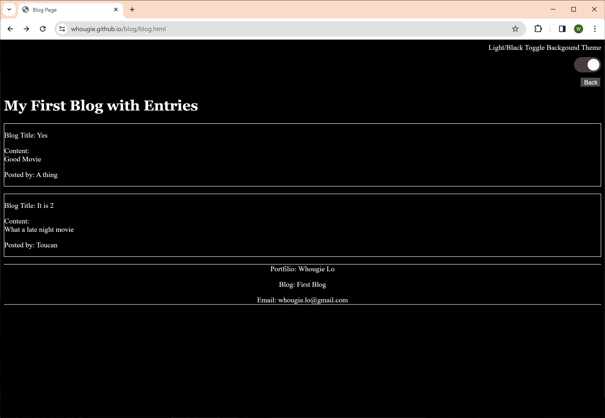

# My First Blog

Contains two web pages listed below:

* Blog Form - allows the user to add new blog information to get populate on the Blog Entries page

* Blog Entries - displays the blog entries from the user and controls the toggling of the light and dark theme of the pages

Git repo can be found at - https://github.com/whougie/blog.git

Deployment of app can be found at - https://whougie.github.io/blog/blog.html

Code work from other resource(s):

* Got the slider (light/dark theme toggle) CSS configurations from - https://www.w3schools.com/howto/howto_css_switch.asp